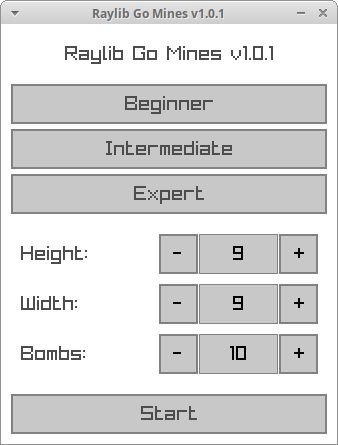
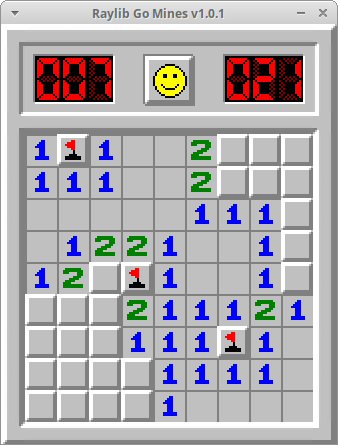

# Raylib Go Mines

Implementation of minesweeper in Go using the Raylib game library.

### Requirements

On Debian based systems: 

    apt-get install libgl1-mesa-dev libxi-dev libxcursor-dev libxrandr-dev libxinerama-dev libwayland-dev libxkbcommon-dev

### Running

To run the software execute:

    go mod tidy
    go run .

First build may take several minutes.
